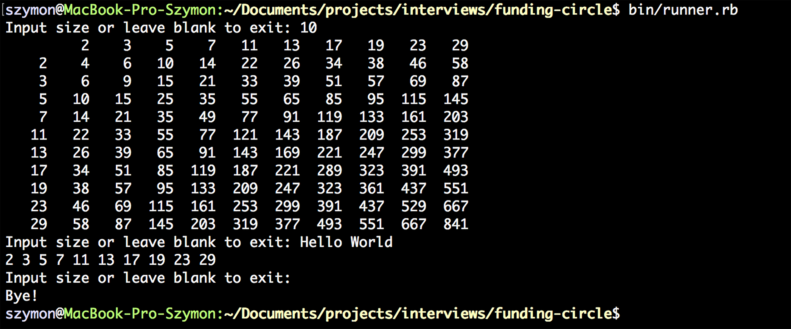

# Multiplication

## Description

Write a program that prints out a multiplication table of first N prime numbers.

## Running

`>bin/runner`

Example output sessions:



## Automatic Tests

```
    bundle exec rspec
```
